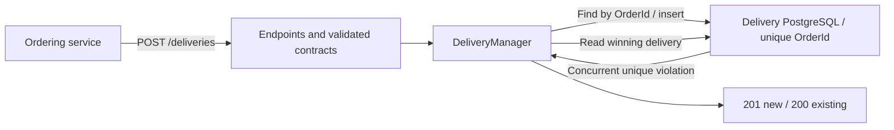

# cronus-delivery-service

Delivery creation and lookup API for Cronus, a cloud-native food-ordering application.
[cronus-ordering-service](https://github.com/hashirsarwar/cronus-ordering-service) requests delivery after
saving an order. This service owns delivery records in PostgreSQL.

## Key Features

- Idempotent delivery creation: repeated requests return the same record for an order.
- Concurrent requests resolve to one persisted delivery.
- Delivery lookup and validated API responses.
- Database-backed API and concurrency tests, health checks and optional telemetry.

## Technology stack

.NET, ASP.NET Core, PostgreSQL and Docker.

## Architecture



Creation returns `201` for a new delivery and `200` for an existing order's delivery.
The service is internal in Kubernetes and is called by ordering.

## Quick start

Use the .NET 10 SDK and PostgreSQL on `localhost:5432`. From the repository root:

```bash
createdb cronus_delivery
dotnet restore --locked-mode
dotnet run
```

The Development launch profile serves `http://localhost:5082`.
Startup applies pending migrations. Start ordering on port 5081 to exercise checkout integration.

Local defaults use the current OS user; PostgreSQL must permit that connection. Supply credentials
through `ConnectionStrings__CronusDelivery` in the environment when required; do not commit them.
Development exposes OpenAPI at `/openapi/v1.json`; [cronus-delivery-service.http](cronus-delivery-service.http)
contains example requests.

Run tests against a **dedicated** database; the suite truncates its tables. Use
`CRONUS_TEST_CONNECTION_STRING` to override the test connection:

```bash
dotnet test tests/Cronus.DeliveryService.Tests
```

Azure deployment requires private database access, matching Entra grants and separate runtime/migration
identities. GitOps applies migrations before rollout. Keep the API within its intended access boundary;
customer authentication is not configured.

## Related repositories

| Repository | Responsibility |
| --- | --- |
| [cronus-infrastructure](https://github.com/hashirsarwar/cronus-infrastructure) | Azure resources, managed identities and PostgreSQL privilege bootstrap. |
| [cronus-gitops](https://github.com/hashirsarwar/cronus-gitops) | Argo CD bootstrap, Helm charts, Gateway routes and environment-specific deployments. |
| [cronus-ordering-service](https://github.com/hashirsarwar/cronus-ordering-service) | Restaurant catalogue, cart rules, order persistence and delivery integration. |
| [cronus-web](https://github.com/hashirsarwar/cronus-web) | Restaurant-to-order browser journey and runtime-configured telemetry. |
